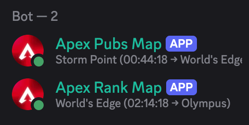

# apex-discord-bot

Two Discord bots that display the current Apex Legends map rotation as their status — one for pubs, one for ranked.



## What it does

Polls the [Apex Legends API](https://apexlegendsapi.com/#map-rotation) every 5 seconds and updates the two bots' Discord presence to show the current map, time remaining, and next map:

```
World's Edge (12m → Storm Point)
```

## Setup

### Environment variables

```
DISCORD_TOKEN_PUBS=    # Bot token for the pubs status bot
DISCORD_TOKEN_RANK=    # Bot token for the ranked status bot
APEX_API_TOKEN=        # API key from apexlegendsapi.com
```

### Build & run

```bash
cargo build --release
./target/release/apex-discord-bot
```

### With Nix

Supported systems: `x86_64-linux`, `aarch64-linux`, `x86_64-darwin`, `aarch64-darwin`.

```bash
nix run .
```

## Running as a daemon (NixOS)

Add the flake as an input and reference the package in your NixOS configuration:

```nix
# flake.nix
inputs.apex-discord-bot.url = "github:birkhofflee/apex-discord-bot";
```

```nix
# configuration.nix
{ inputs, pkgs, ... }:
{
  systemd.services.apex-discord-bot = {
    description = "Apex Discord Bot";
    wantedBy = [ "multi-user.target" ];
    after = [ "network.target" ];
    serviceConfig = {
      ExecStart = "${inputs.apex-discord-bot.packages.${pkgs.system}.default}/bin/apex-discord-bot";
      Restart = "on-failure";
      EnvironmentFile = "/etc/apex-discord-bot/env";
    };
  };
}
```

Create `/etc/apex-discord-bot/env` with the variables above, then `nixos-rebuild switch`.

## License

MIT
